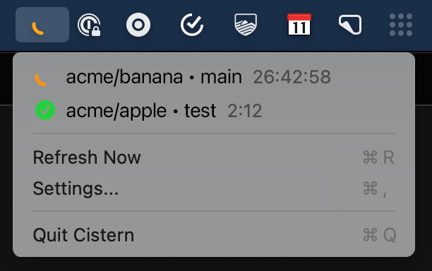

# Cistern

A macOS menu bar app for monitoring your CircleCI builds.

## Features

- **Lives in your menu bar** — Always visible, never in the way
- **Real-time build status** — See your builds at a glance with color-coded status icons
- **Animated running builds** — A spinning "C" indicator shows builds in progress with live-updating
  duration
- **Click to open** — Jump straight to any build in CircleCI
- **Configurable refresh interval** — From 1 second to 1 hour, with a smooth logarithmic slider
- **Filter by organization** — Focus on the builds that matter to you
- **Shows only your builds** — No noise from other team members' pipelines
- **Secure token storage** — API token stored safely in macOS Keychain
- **Native macOS app** — Built with Swift and AppKit, lightweight and fast
- **Dark mode support** — Looks great on both light and dark menu bars

## A note on how the app displays status

CircleCI’s API has some notable limitations. In particular, it does not provide an endpoint for
retrieving currently running builds. The only relevant option for listing builds is an API that
returns pipelines ordered by their creation time.

This creates a challenge because builds for older pipelines are not reordered when new activity
occurs. In theory, a build that is currently running could belong to a pipeline created months ago,
and the only way to discover it would be to paginate through the entire pipeline history.

To limit the number of requests to the CircleCI API, we only fetch pipelines created within the last
7 days. This approach captures most running builds, but it is not a perfect solution. If you are not
seeing a build in Cistern, it could be due to this issue.

## Installation

1. Clone this repository
2. Open `Cistern.xcodeproj` in Xcode
3. Build and run (⌘R)
4. Click the menu bar icon and go to Settings to add your CircleCI API token

## Getting a CircleCI API Token

1. Go to [CircleCI](https://app.circleci.com)
2. Click your profile icon → **User Settings**
3. Select **Personal API Tokens**
4. Click **Create New Token**
5. Copy the token and paste it into Cistern's settings

## Build Status Icons

| Icon                | Status             |
|---------------------|--------------------|
| ✓ Green             | Success            |
| Spinning C (orange) | Running            |
| ✗ Red               | Failed             |
| ⏸ Yellow            | On Hold            |
| − Gray              | Canceled / Not Run |

## Requirements

- macOS 13.0 or later
- Xcode 15.0 or later (for building)

## Why "Cistern"?

Cisterns are circular. Also, it starts with "CI".

## License

[MIT](LICENSE)
